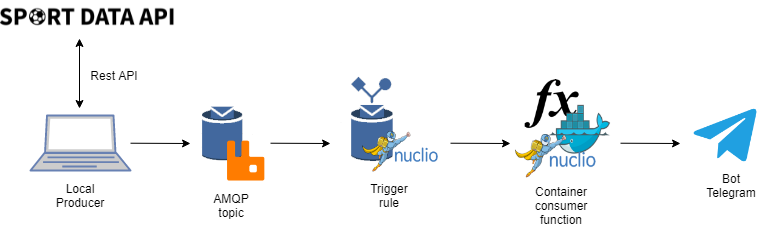

# SCIOT-LiveScore
| **Petrazzuolo Lorenzo** | **0522500894** |
| --- | --- | 

Exam project for _Serverless Computing for IoT_ of the course year 2020/2021. Master's degree in Computer Science. 
___

The idea of this project is to have a system of Livescore about Football matches. In detail, the system permits to check the results of Football matches in real time and, when one of them changes, a Telegram message is sent to the user with the updated result. In the message there are info about the minute of the gol event and the updated result. In addiction to this, a Telegram message is sent when the Football match is over. 

## Architecture

The architecture of the project is composed by several components. A Python script, deployed and run in local, sends every 30 seconds a request to an API of [__Sport Data API__](https://sportdataapi.com/) (livescore data provider). The received data contain the scores of Football matches in real time of a certain League (in our case "Serie A"). The data are organized in a JSON object and sent to a queue of the RabbitMQ message broker. Receiving the message on the queue triggers a serverless function deployed on Nuclio. The first time, the function saves the state of the scores, from the second time, the state is compared with the new scores. If the score is different, a message is sent to a Telegram user with information on live and minute result, if the match is over a message with the names of Football teams and the final result is sent, if all the Football matches are over, a notification message is sent to the Telegram user and both Nuclio function and local function are stopped. 



## Prerequisites

- Docker and Docker Compose (Application containers engine)
- Nuclio (Serverless computing provider)
- RabbitMQ (AMQP and MQTT message broker)
- Python (version >3.7)

## Installation

First of all, you need to get a subscription with [__Sport Data API__](https://sportdataapi.com/) and to choose the leagues of which you would get scores in order to fill in the fields _headers_ and _paramsAPI_ in the producerLiveScore script.

```python
headers = { 
  "apikey": "xxxxxxxxxxxxxxxxxxxx"}

paramsAPI = (
   ("season_id","xxx"),
   ("date_from","xxxx-xx-xx"),
   ("live","true")
)
```

After, you have to create a Telegram bot with [__BotFather__](https://t.me/BotFather) in order to fill in the fields in the consumerLiveScore script on Nuclio:

```python
my_token="xxxxxxxxxxxxxxxxxx"
my_telegram_ID="xxxxxx" 
```

Start the docker container that contains the instance of RabbitMQ server:

```sh
docker run -p 9000:15672  -p 1883:1883 -p 5672:5672  cyrilix/rabbitmq-mqtt 
```

Start the docker container of Nuclio so that you can deploy the consumerLiveScore function:

```sh
docker run -p 8070:8070 -v /var/run/docker.sock:/var/run/docker.sock -v /tmp:/tmp nuclio/dashboard:stable-amd64
```

Connect to __localhost:8070__ and, after creating a new project, create a new function importing the _consumerLiveScore.yaml_ file (_Remember to update my_token and my_telegram_ID as said before_).

Then, install the python libraries useful to run the last script:

```bash
pip install pika
pip install requests
pip install jsonpickle
```

The last step is to run on another terminal the _producerLiveScore_ script. So, open a terminal from the root of project and run the script:

```bash
python3 producerLiveScore.py
```

## Demo

